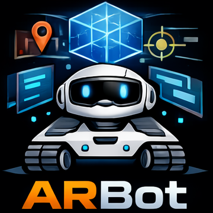

<div align="center">
<h1>
  
  ARBot: A High-Fidelity Robotic Manipulator Teleoperation Framework for Human-Centered Augmented Reality Evaluation
</h1>

[**Harsh Chhajed**](https://sites.google.com/view/harshchhajed)<sup>1</sup> · [**Tian Guo**](https://tianguo.info/)<sup>2</sup>

Worcester Polytechnic Institute

</div>

<div align="center">
  <a href="https://dl.acm.org/doi/10.1145/3793853.3799807"></a>
  <a href="https://arxiv.org/abs/2602.06273"></a>  
  <p style="background-color: #f0f8ff; padding: 10px; border-radius: 5px; width:40%" >
  </p>


</div>

## Table of Contents  
- [Full Repository Installation](#full-repository-installation)
- [Install Procedure for Particular Submodules](#install-procedure-for-particular-submodules)
- [Dataset](#dataset)
- [Demo Videos](#demo-videos)
- [Citation](#citation)
- [License](#license)


## Full Repository Installation  
To download the repositories with all the dependencies, use the following command:
```bash
git clone --recurse-submodules https://github.com/cake-lab/ARBot.git
```

## Install Procedure for Particular Submodules
Use the table below as a reference to build and run your code:

| Sub-Module Name | Content                                                                   | Step-by-Step Implementation Procedure                                |
| :-------------- | :------------------------------------------------------------------------ | :------------------------------------------------------------------- |
| AR-PiPER        | ROS2 Package to simulate and control the PiPER Arm                        | [AR-PiPER](https://github.com/cake-lab/AR-PiPER/blob/main/README.md) |
| AR-OMX          | ROS2 Package to simulate and control the Robotis Open Manipulator X Arm   | [AR-OMX](https://github.com/cake-lab/AR-OMX/blob/main/README.md)     |
| AR-CV           | Vision-based Teleoperation system for the CV+IMU control setup            | [AR-CV](https://github.com/cake-lab/AR-CV/blob/main/README.md)       |
| ARPose          | Android Studio Files for the ARPose Mobile Application                    | [ARPose](https://github.com/cake-lab/ARPose/blob/main/README.md)     |

## Dataset  
The Full Dataset (132 User Trajectories) can be found at [**Dataset**](https://drive.google.com/drive/folders/1G7c1eUC-Iz520lqaE077X5Flvq8blLnZ).

## Demo Videos 
These are a few demo videos for your reference. We will have more demo videos for you shortly.
1. [**CV+IMU Interface**](https://drive.google.com/file/d/1VjITGwzkQLmal4xdXsaT_iV-3kNjdCD8/view?usp=drive_link)
2. [**CV+IMU Demo**](https://drive.google.com/file/d/1Z5jzTr8tb5N-JOF8WMgJOlCP0_4tsF_e/view?usp=drive_link)
3.  [**ARPose Application Interface**](https://drive.google.com/file/d/1X8K3hZk1EJHmHe50lMYxUsKMgj8OQIDr/view?usp=drive_link)
4. [**ARPose Application Demo**](https://drive.google.com/file/d/1324HGlZf_FzXDWoYewhlxSaan-apt4sX/view?usp=drive_link);
5. [**Synthetic/Autopilot Test Demo**](https://drive.google.com/file/d/1MwcpBHuZDvIcs2RHiYREru_yq0Fb4_qH/view?usp=drive_link)
6. [**Repeatability Demo**](https://drive.google.com/file/d/1YyK5cY2xDm7AgdSEWj-_Hf-RHP_pOACt/view?usp=drive_link)  

## Citation
If you use ARBot in your research, please cite:

```bibtex
@inproceedings{10.1145/3793853.3799807,
author = {Chhajed, Harsh and Guo, Tian},
title = {ARBot: A High-Fidelity Robotic Manipulator Teleoperation Framework for Human-Centered Augmented Reality Evaluation},
year = {2026},
isbn = {9798400724817},
publisher = {Association for Computing Machinery},
address = {New York, NY, USA},
url = {https://doi.org/10.1145/3793853.3799807},
doi = {10.1145/3793853.3799807},
abstract = {Validating Augmented Reality (AR) tracking and interaction models requires precise, repeatable ground-truth motion. However, human users cannot reliably perform consistent motion due to biome-chanical variability. Robotic manipulators are promising to act as human motion proxies if they can mimic human movements. In this work, we design and implement ARBot, a real-time teleoperation platform that can effectively capture natural human motion and accurately replay the movements via robotic manipulators. ARBot includes two capture models: stable wrist motion capture via a custom CV and IMU pipeline, and natural 6-DOF control via a mobile application. We design a proactively-safe QP controller to ensure smooth, jitter-free execution of the robotic manipulator, enabling it to function as a high-fidelity record and replay physical proxy. We open-source ARBot and release a benchmark dataset of 132 human and synthetic trajectories captured using ARBot to support controllable and scalable AR evaluation.},
booktitle = {Proceedings of the ACM Multimedia Systems Conference 2026},
pages = {409–415},
numpages = {7},
keywords = {Augmented Reality, Robot Teleoperation, Human-Robot Interaction},
location = {
},
series = {MMSys '26}
}
```

## License

This project is licensed under the terms of the LICENSE file in this repository.
